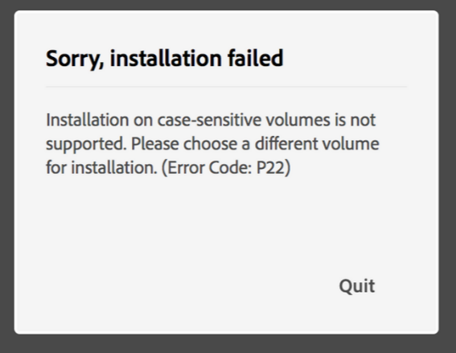

# case INSENSITIVITY

A few years ago, I corrupted my macOS install. To rectify it, I had no choice but to reformat my hard drive. Reformatting is simple enough to do on a Mac. You hold `⌘-R` during startup, bringing you into the recovery menu. After more configuration, you see a setting for the drive meekly titled "format."

I have a background in Linux, which typically has case-sensitive file systems by default, so I elected to go with the "APFS (Case-sensitive, Encrypted)" option. I was unaware, but I had made an **unrecoverable** error that would later punish me.

Fast forward to the present: For my CSCI-431W class at Chico State, I was instructed to install Adobe XD. I assumed this would be trivial, so I waited until the last minute. At around 9:30 AM, I go to the Adobe XD website, download it, and open the installer, only to be greeted with this:

This error message from Adobe is useless. A good error message should be **recoverable**, but outside of the hint that I should "choose a different volume," this error screen gives me nothing to go off. But here's the thing: *I didn't even choose a volume!* There wasn't even an option to *pick* a volume.

I was lost, so I searched the internet for the error. I finally discovered the full ramifications of my actions years prior: it is **impossible** to install Adobe products if you have formatted your macOS install volume to be case-sensitive. Furthermore, you cannot convert a case-sensitive drive to a case-insensitive one without wiping your disk.

Luckily, I don't store any irreplaceable data on my laptop, so at about 9:45 AM, I promptly decide to reformat my disk. I've done it before, so I meander through the "`⌘-R` -> delete partition -> blah blah blah" procedure I vaguely remember. But I messed up: I deleted my primary partition and then rebooted, inadvertently deleting the recovery image built into macOS.

Luckily Apple engineers have added a failsafe for this exact situation. It is
still possible to recover from this error without much effort, or at least so I
thought. You can do an "internet recovery" which downloads the required files to repair your operating system over wifi. By holding `⌘-Shift-R`, I accessed this interface. I then tried connecting to the `csuchico` network. It failed. I then tried the `csuchico-guest` network. It also failed. Finally, I connect to my phone's wireless hotspot. It's about 10:20. I wait for the download for the next 20 minutes, and right after the progress bar reaches the end: it errored out.

At this point, I had to leave for my next class which is directly before my 431W class, so I accepted my fate that I would not be able to use Adobe XD if required in class that day. 

Fortunately, I didn't need it until the following week. However, I now had a pressing problem: When I arrived home for the day, I tried again to recover from the network using my home wifi, believing the error to be related to a poor connection over my hotspot. Once again, it gave an enigmatic error with no explanation. I migrate to a backup plan of recovering from a USB drive connected to my laptop. I enlist the help of my roommate's laptop to format my USB drive and then plug it in. Once again, I get the same error.

I now became worried that I had somehow permanently bricked my laptop. Apparently, since my laptop is a newer model with a T2 security chip, it was not possible to do an internet or USB recovery. You must first do the additional step of "restoring" your Mac by resetting the firmware on the T2 chip. The only way to do this is by installing the "Apple Configurator Software" application and then connecting two Macs using specific USB ports on each device.

Apple's recovery design is flawed because it gives little **visibility of system status**. There is no way to tell if your Mac has a T2 chip and it is preventing you from reinstalling your operating system. You must guess that that is the case and hope that you have access to another Mac to test your hypothesis.

A few years ago, I decided to format my drive using a case-sensitive file system. This is not a decision anyone would make if they were aware of its full ramifications. Apple's recovery menu is not very **error tolerant** in selecting a filesystem type. It fails to make users aware of their mistakes, and when it does, there is no way to recover. Further, their recovery flow for Macbooks with T2 chips fails to give the user a solid **visibility of system status**. Their internet recovery flow does not tell the user why it fails. If Apple's designs were reworked to factor in common UX charactaristics, perhaps I would not have made the mistakes that I did.